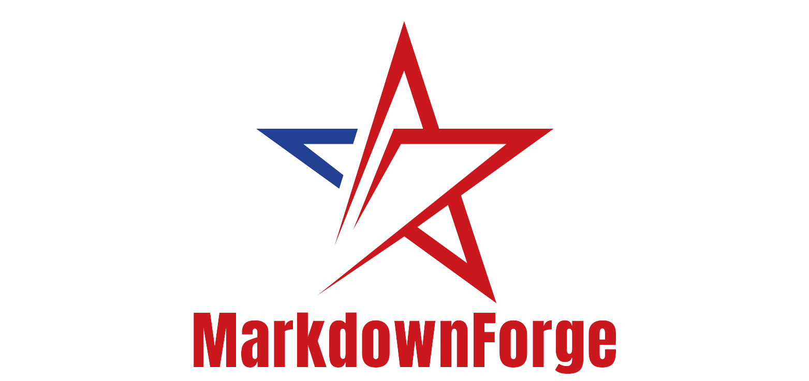

# MarkdownForge



**Transform your Markdown files into elegantly styled PDF documents with a single click.**

MarkdownForge is a powerful yet simple web application that converts your Markdown files into beautifully formatted PDF documents, preserving all your content's structure and styling.

## ✨ Features

- **Effortless Conversion** - Upload and convert Markdown files to PDF in seconds
- **Faithful Formatting** - Preserves headings, lists, code blocks, and text styling
- **Multiple Input Formats** - Supports .md, .markdown, and .txt files
- **Elegant Output** - Creates professional-looking PDF documents with customizable styling
- **Web-Based Interface** - No software installation required, accessible from any device
- **Fast & Reliable** - Built with performance and stability in mind

## 🚀 Getting Started

### Online Service

Visit [https://markdownforge.onrender.com](https://markdownforge.onrender.com) to use the tool online.

### Local Development

1. **Clone the repository**
   ```
   git clone https://github.com/sculptorofcode/markdownforge.git
   cd markdownforge
   ```

2. **Install dependencies**
   ```
   pip install -r requirements.txt
   ```

3. **Run the application**
   ```
   python app.py
   ```

4. **Access MarkdownForge**
   
   Open your browser and navigate to `http://localhost:5000`

## 🛠️ Deployment

MarkdownForge can be easily deployed to Render:

1. Push your repository to GitHub
2. Log in to your Render account
3. Create a new Web Service
4. Connect to your GitHub repository
5. Configure your service:
   - Build Command: `pip install -r requirements.txt`
   - Start Command: `gunicorn app:app`
6. Set any necessary environment variables
7. Deploy the service

## 📋 Usage Guide

1. Click the "Choose File" button to select your Markdown file
2. Press "Convert" to transform your file
3. Download your beautifully formatted PDF
4. Enjoy your professional-looking document!

## 🔧 Advanced Options

- Customize page margins and styling
- Choose from different themes or create your own
- Set document properties including title, author, and keywords
- Configure header and footer options

## 💡 Coming Soon

- Batch processing of multiple files
- Custom CSS styling options
- Real-time preview
- API access for programmatic conversions

## 📝 License

This project is licensed under the MIT License - see the LICENSE file for details.

## 🤝 Contributing

Contributions are welcome! Please feel free to submit a Pull Request.

---

**MarkdownForge** - *Crafting beautiful documents from simple Markdown.*
